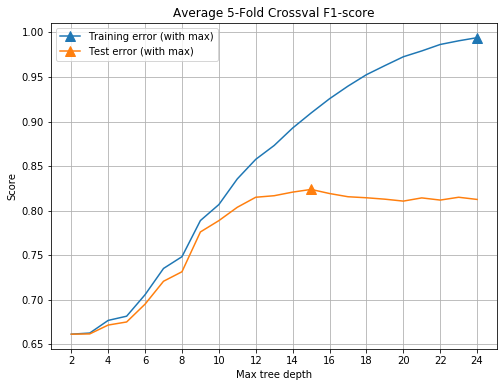

# Detecting Seperatable verbs

## Introduction

When one is wants to translate a word in a that was written in a foreign language, it can be the case that the word is part of a certain structure. Because of this the meaning of the individual word can be different then when it is combined with the total context of the structure. Examples of these structures are idioms, expressions or separable-verbs. To improve the translation of a word that is part of such a structure it has to be detected and be notified to the user. To accomplish this, a database of structures has to be created. In this report we describe the methods used to create such a dataset  and present the results.

## Collocations
One method to detect separable verbs is to use collocations, collocations are groups of words that occur often together. To find these group of words we first have to extract them from the dataset. This can be performed using various techniques which include N-grams and skip-grams. To extract the collocations we developed a method that, combines n-grams and skip-grams for 22 word collocations, by multiplying each word with the tail of the sentence after that word. For example in "the brown fox jumps"  the word "brown" is multiplied with ["fox", "jumps"] and zipped with the skip distance to create the collocations list [("brown", "fox", 0), ("brown", "jumps", 1)] which extracts all possible collocations from each sentence. The skips from each sentence are collected in a skips list for later analysis.
After multiplying each word in all sentences, the resulting collocations are then gathered and counted. 
## Association metrics

In the set of collocations $C$, each collocation has it's own frequency $f_cw_1w_2$, we join/add/insert the wordcount for each word $w_1x$, $w_2x$. The total number of collocations $N = sum(f_cw_1w_2: \forall w_1w_2 \in C)$.

#### Frequency
The simplest metric for finding usefull collocations is to look at the frequency that a collocation has in the dataset. A collocation with a high frequency has a lot of evidence to be a collocation that is used a lot in spoken language. But, it also introduces a lot of noise by combining 2 words that have an individual high frequency but don't contain useful information together.

#### Pointwise mutual information
PMI is a association metric that indicates what a word tells about the other. It was introduced by (Church & Hanks, 1990) and is implemented as:

$PMI = \textbf{log}_2(f_cw_1w_2 * N) - \textbf{log}_2(w_1*w_2)$

(church1990word)
(Manning and Schütze, 1999)

#### Contingency
To calculate chi-squared and the likelihood-ratio we first have to calculate the contingency matrix $O$, which is defined as:

|               | $w_{1}$                       | $\lnot w_{1}$               |
| --------      |:-----------------------------:| :--------------------------:|
| $w_2$         | $f_cw_1w_2$                   | $w_1 - f_cx = f_c\not{w_1}w_2$ |
| $\lnot w_{2}$ | $w_2 - f_cx = f_cw_1\not{w_2}$   | $N$                         |

and where

$f_c\not{w_1}\not{w_2} = N - f_cw_1w_2 - f_cw_1\not{w_2} - f_c\not{w_1}w_2$
#### Persons chi-squared
Chi-squared is a metric to indicate the dependence when comparing to the expected results $E$ and is defined as 

$\chi^2 = \sum_{i,j}{\frac{(O_{i,j}-E_{i,j})^2}{E_{i,j}}}$
(Manning and Schütze, 1999)

#### Other
  Other metrics that wher applied where likelihood ratio and Fisher's Exact Test (Petersons, 1996)

# Dataset

The dataset the is used is based on the subtitle data from [OpenSubtitles](http://www.opensubtitles.org/) of which we use the German, Dutch, French and Spanish subtitles.

### Pre-processing
  To handle the 500GB of subtitle data from the opensubtitle data, single-core processing on commodity hardware has become insufficient. Therefore, multi-core processing is needed to bring the processing time down to a workable amount. To achieve this, the processing was performed on a 64 core cluster using [Apache Spark](https://spark.apache.org/) to utilize multi-core processing.

  First the raw subtitle data was read to a DataFrame and cleaned. After this the collocations are computed and grouped with frequency count and the skip list is counted to a histograms. A section of the results is show in the table below.

|    word1|  word2|frequency|               skips|
|---------|-------|---------|--------------------|
| zusammen|   eine|      999|{0: 99, 1, 39,...   |
|geschieht|    mit|      999|{0: 8, 1: 692,...   |
|     sehe|    für|      999|{0: 114, 1: 45,...  |
|      den|knochen|      999|{0: 16, 1: 73,...   |
|      mr.|  seine|      999|{0: 392, 1: 91,...  |
|     ding|    auf|      999|{0: 7, 1: 162,...   |
|     mein|   zeit|      999|{0: 429, 1: 13,...  |
|    armee|    von|      999|{0: 6, 1: 155,...   |
|   arbeit|   mich|      999|{0: 22, 1: 118,...  |
|     rede|     so|      999|{0: 514, 1: 26,...  |

Besides the collocations the wordcount for each individual word is also computed and stored in a seperate dataset for later use.

# Experiments
  After the datasets have been pre-processed the wordcounts of $w_1$ and $w_2$ are added to the dataset. So we can compute the metrics.

## Bigram-accociation metrics

Where computed using Apache spark.

|word1     |word2     |frequency|skip_average|skip_variance|word_1_frequency|word_2_frequency|chi       |pmi   |ll      |fisher|
|----------|----------|---------|------------|-------------|----------------|----------------|----------|------|--------|------|
|verenigde |   staten | 11015   |8.58        |8.54         | 12776          | 16449          |3.199e+08 |14.825|2.29e+05|1.00  |
|      new |     york | 61385   |5.68        |5.67         | 86058          | 63234          |3.836e+08 |12.609|1.12e+06|1.00  |
|      los |  angeles | 12852   |5.68        |5.66         |114910          | 13089          |6.083e+07 |12.209|2.17e+05|0.99  |
|      leg |     neer | 23371   |0.48        |0.48         | 69712          |112348          |3.860e+07 |10.691|3.13e+05|1.00  |
|      per |  ongeluk | 11879   |4.93        |4.92         |104282          | 59025          |1.268e+07 |10.062|1.45e+05|1.00  |
|    leren |   kennen | 19048   |6.86        |6.84         |109016          | 96000          |1.917e+07 | 9.977|2.33e+05|1.00  |
|     lang |    duren | 10708   |3.75        |3.74         |327070          | 31209          |6.206e+06 | 9.183|1.19e+05|0.99  |
|   schiet |     neer | 15196   |1.93        |1.93         |133944          |112348          |8.476e+06 | 9.128|1.65e+05|1.00  |
|     tien |  minuten | 18798   |3.30        |3.29         |120470          |166115          |9.751e+06 | 9.023|2.02e+05|1.00  |
|      per |     week | 12378   |5.73        |5.71         |104282          |133675          |6.068e+06 | 8.942|1.31e+05|0.99  |    

## Supervised learning
  ### Dataset creation
  To perform supervised learning to classify separable verbs a labeled dataset has to be created. This is performed using 9000 German so called "Trennenbare verben" retrieved from [Canoonet](http://www.canoo.net) , which are german seperatable verbs. To query the collocations that contain separable verbs the collocation words are concatenated in order and reverse order. These resulting words and the canoonet list are then stemmed using the nltk German stemmer. Words that appear in both sets are assigned the label $1$ in the collocations dataset and a similar amount of random selected collocations that do not appear in both is assigned the label $0$. This results in a dataset containing 6936 samples.

  ### Learning
  To learn rules for classifying separable verbs multiple classification algorithms where applied on the training data. DecisionTrees turned out to be only classfier that performed better then random guessing. A 5-fold cross validation using train- and testset is performed on as validation scheme using the F1-score.

  #### Results

  

@book{manning1999foundations,
  title={Foundations of statistical natural language processing},
  author={Manning, Christopher D and Manning, Christopher D and Sch{\"u}tze, Hinrich},
  year={1999},
  publisher={MIT press}
}

@article{church1990word,
  title={Word association norms, mutual information, and lexicography},
  author={Church, Kenneth Ward and Hanks, Patrick},
  journal={Computational linguistics},
  volume={16},
  number={1},
  pages={22--29},
  year={1990},
  publisher={MIT Press}
}

@article{pedersen1996fishing,
  title={Fishing for exactness},
  author={Pedersen, Ted},
  journal={arXiv preprint cmp-lg/9608010},
  year={1996}
}
